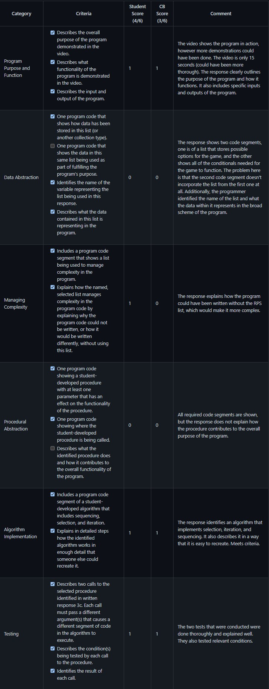
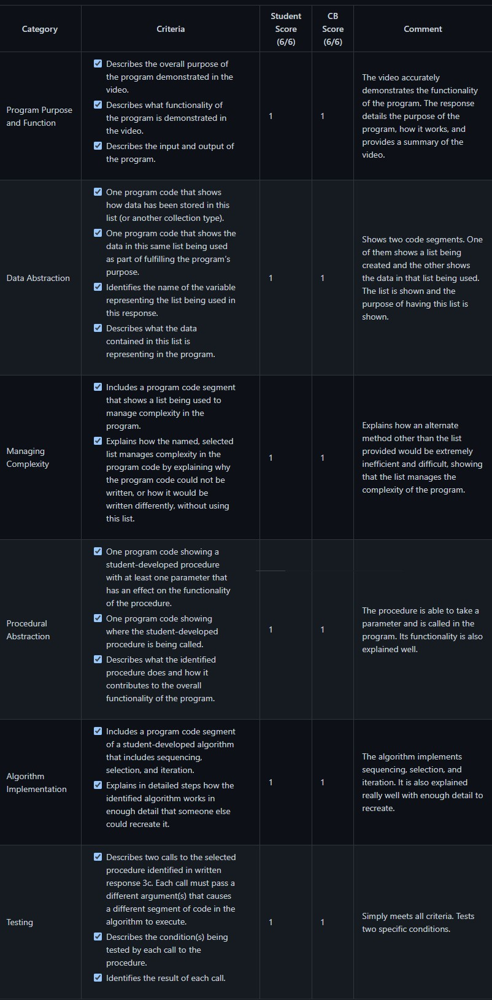
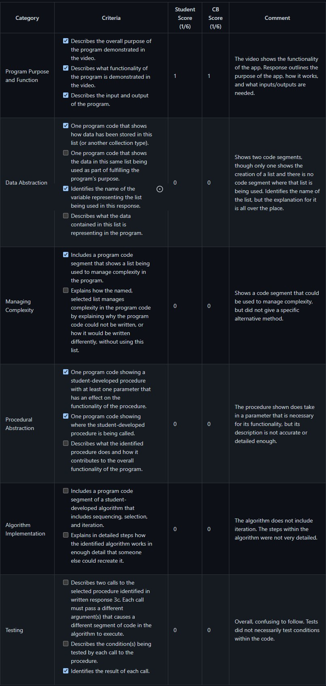
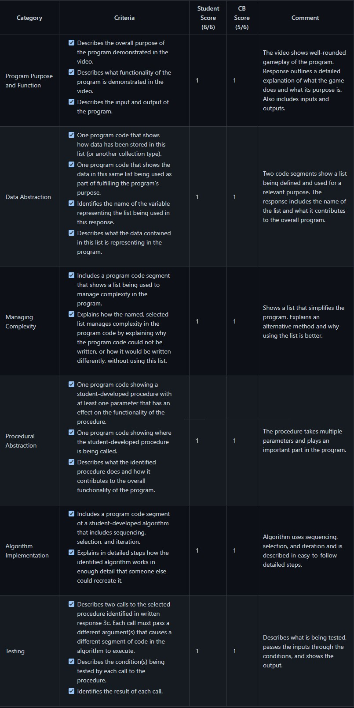

# Submission 1

# Submission 2

# Submission 3

# Submission 4

# Reflection

I think my scoring is pretty similar to the CollegeBoard scores that these samples received. I have a pretty good understanding of the criteria and what my project needs in order to succeed. In order to fulfill all requirements, my project must be well-rounded and include a variety of functions and abstraction. One of the most prominent reasons a submission may not have met the criteria in one area was a lack of detail in explaining how something works. I will make note of that and be sure to explain everything I can in as much detail as possible in order to make it clear how my project meets the standards.