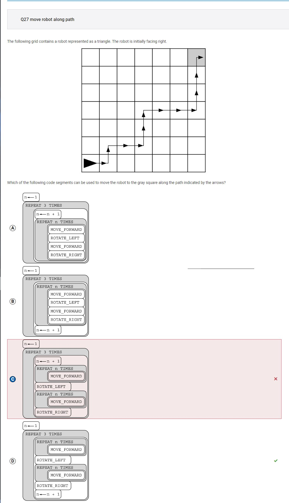
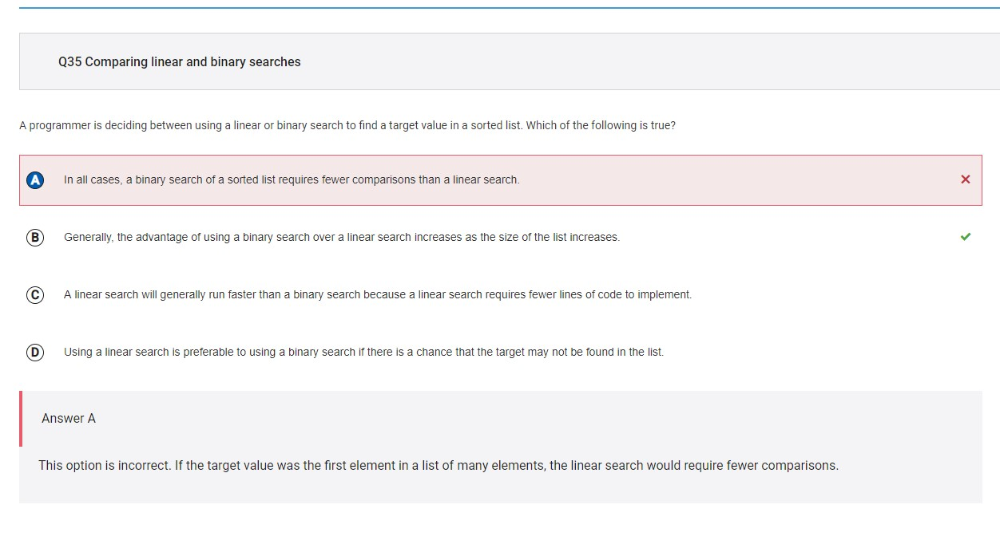
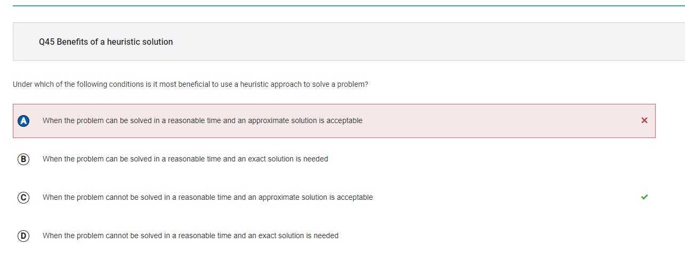

# My score

I earned a 45/50, or 90% on the CollegeBoard midterm.

Here is proof:

# Error Corrections

## #1

My answer: B) x=1, y=3, z=2

> This is wrong because the x, y, and z values listed in option B all cause the code segment to work as intended

Correct answer: D) x=3, y=2, z=1

> This answer is correct because the procedure sets z as the maximum, causing it not work as intended since x is the maximum value entered.

## #27

My answer: C)

> This is wrong because the procedure increments the value of n too early, causing the function to not work as intended.

Correct answer: D)

> This answer is correct because the procedure sets increments the value of n correctly, following the robot's path perfectly.

## #35

My answer: C) In all cases, a binary search of a sorted list requires fewer comparisons than a linear search.

> This answer is wrong because it does not apply to all cases; if a target value appears relatively early in a list, it would take less comparisons with linear search.

Correct answer: B) Generally, the advantage of using a binary search over a linear search increases as the size of the list increases.

> This answer is correct because it is a general statement that is true. Since binary search divides the list of data into two parts after for each comparison, it would make it more advantageous for longer lists as opposed to comparing each value with every other one in the list.

## #45

My answer: A) When the problem can be solved in a reasonable time and an approximate solution is acceptable.

> This answer is wrong because it doesn't make sense that a heuristic solution would be useful when the problem can be solved in a reasonable time, since you're better off trying to actually solve the problem then.

Correct answer: C) When the problem cannot be solved in a reasonable time and an approximate solution is acceptable.

> This answer is correct because these are the exact conditions where a heuristic solution is desired.

## #48

My answer: C) Interchanging line 6 and line 7.

> This answer is wrong because both lines are inside the for-loop, which wouldn't really affect the number of operations that are performed, merely changing the order in which the operations are performed.

Correct answer: D) Interchanging line 7 and line 8.

> This answer is correct because the program would not be calculating the average in every iteration, but rather, one time at the end, which would effectively reduce the number of operations performed by the program.